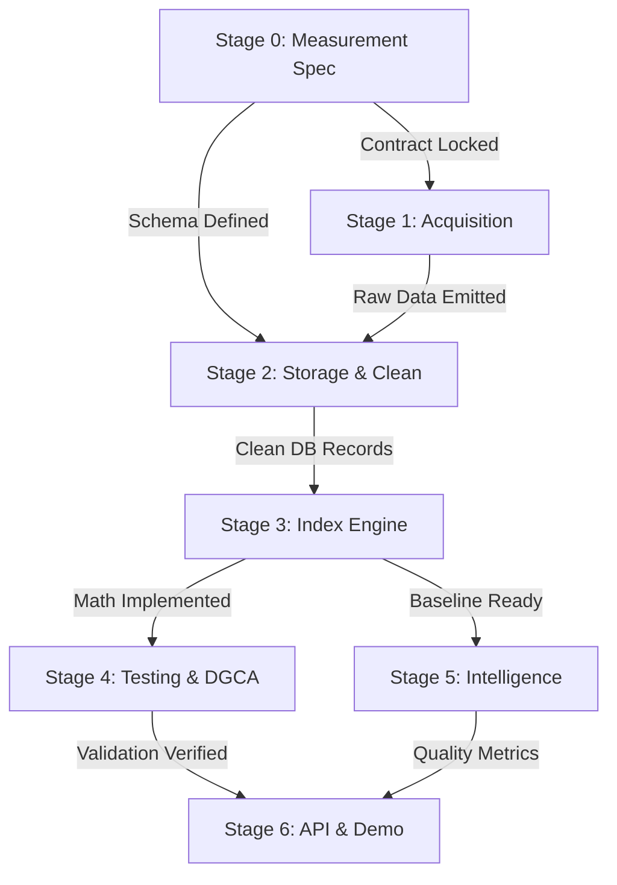

# APEX Master Development Roadmap

This document provides the high-level status, dependencies, and gating conditions across all development stages of the APEX engine.

> **Agent Directive**: Do not read individual stage documents ahead of time. Check [`plan/CURRENT_STAGE.md`](file:///Users/suvasanketrout/Developer/APEX/plan/CURRENT_STAGE.md) and read **only** the active stage file.

---

## Stage Summary Table

| Stage | Name | Key Objective | Status | Spec File |
|---|---|---|---|---|
| **0** | **Measurement & Contract** | Define canonical FareObservation, 5-route basket, 5 booking windows, price definitions | `ACTIVE` | [`stage-00-measurement-spec.md`](file:///Users/suvasanketrout/Developer/APEX/plan/stages/stage-00-measurement-spec.md) |
| **1** | **Data Acquisition** | Build Playwright scraping engine, IndiGo adapter, raw payload storage, rate limiter | `PENDING` | [`stage-01-data-acquisition.md`](file:///Users/suvasanketrout/Developer/APEX/plan/stages/stage-01-data-acquisition.md) |
| **2** | **Cleaning & Storage** | Local PostgreSQL schema, raw-to-normalized pipeline, duplicate handling, missing states | `PENDING` | [`stage-02-cleaning-storage.md`](file:///Users/suvasanketrout/Developer/APEX/plan/stages/stage-02-cleaning-storage.md) |
| **3** | **Statistical Engine** | Day-0 median baseline, route index, weighted national index, lead-time curve | `PENDING` | [`stage-03-index-engine.md`](file:///Users/suvasanketrout/Developer/APEX/plan/stages/stage-03-index-engine.md) |
| **4** | **Testing & Robustness** | Offline synthetic test suite, failure/edge cases, 30-day DGCA validation backtest | `PENDING` | [`stage-04-testing-robustness.md`](file:///Users/suvasanketrout/Developer/APEX/plan/stages/stage-04-testing-robustness.md) |
| **5** | **Intelligence & Trust** | Data quality score, confidence score, price anomaly detection, provenance trace | `PENDING` | [`stage-05-intelligence-trust.md`](file:///Users/suvasanketrout/Developer/APEX/plan/stages/stage-05-intelligence-trust.md) |
| **6** | **API & Demonstration** | FastAPI endpoints (`/index`, `/lead-time`, `/provenance`), demo polish, export reports | `PENDING` | [`stage-06-api-dashboard.md`](file:///Users/suvasanketrout/Developer/APEX/plan/stages/stage-06-api-dashboard.md) |

---

## Stage Dependencies & Gates

### Stage Gates
1. **Gate 0 → 1**: Formal JSONSchema and Pydantic models for `FareObservation` validate clean sample fixtures. Route basket and booking window specs finalized.
2. **Gate 1 → 2**: IndiGo collector successfully captures real DEL→BOM T+15 fares and emits valid `FareObservation` objects with raw payloads.
3. **Gate 2 → 3**: Local PostgreSQL database migrated; normalization pipeline converts raw observations into validated, deduplicated records.
4. **Gate 3 → 4**: Index engine calculates Day-0 route baselines, route indexes, weighted national index, and lead-time curves deterministically.
5. **Gate 4 → 5**: Synthetic fixture suite passes 100%; DGCA validation backtest computes MAE, MAPE, RMSE, and correlation.
6. **Gate 5 → 6**: Provenance drilldown and data quality/confidence scoring operational.
7. **Gate 6 Complete**: FastAPI endpoints active, documented, and ready for frontend/PPT demonstration.
